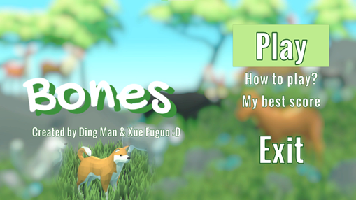
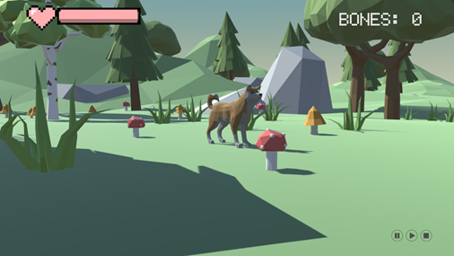
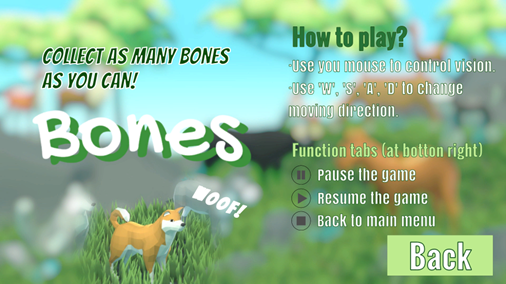
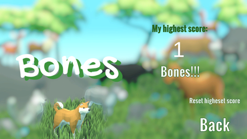

ines (109 sloc)  4.82 KB
   

# Bones Game Guide
<!-- TABLE OF CONTENTS -->

  
Table of Contents

  <ol>
    <li>
      <a href="#about">About</a>
    </li>
    <li>
      <a href="#getting-started">Getting Started</a>
      <ul>
        <li><a href="#prerequisites">Prerequisites</a></li>
        <li><a href="#installation">Installation</a></li>
      </ul>
    </li>
    <li><a href="#how-to-play">How to Play</a></li>
    <li><a href="#acknowledgement">Acknowledgement</a></li>
    <li><a href="#contact">Contact</a></li>
  </ol>

<!-- ABOUT -->
## About

  

The game “Bones” is a 3D collection game designed to bring fun to players and relieve their stress. In the scene filled with beautiful flowers, grass, fungus, and trees, the brown dog (controlled by the player) wants to collect as many bones as possible in a given time. 

<!-- GETTING STARTED -->
## Getting Started
### Prerequisites
Players may run this game on a computer with Windows OS or MacOS.  
If you want to view the game files in Unity, please open them with Unity version 2020.3.26f1. 
### Installation
For Mac users, please download Bones_mac.zip.  
For Windows users, please download Bones_win.zip.

<!-- HOW TO PLAY -->
## How to Play
Upon entering the game, you will firstly see the game homepage:  

  

Details about the buttons are as below. 

  
Play

   
  The “Play” button directs to the game scene.  
   
  

    
  

  
How to play?

   
  The “How to play?” button directs to the introduction to the use of keyboard and mouse, and some function tabs in the game panel.  
   
  

    
  

  
My best score

   
  The “My best score” button directs to the scene displaying his/her best score.  
  "Reset highest score" button is available for you to reset your highest score.  
   
  

    
  

  
Exit

   
  The “Exit” button exits the game. 
   

<!-- ACKNOWLEDGEMENT -->
## Acknowledgement
Due to the limited time given for development, the 3D models in games are obtained from online free resources. We would like to express our sincere thanks for Quaternius for their Ultimate Animated Animal Pack, CRAFTPIX.NET for environment objects like fungus, trees, and stones in game, and Unity Asset Store for the skybox and clouds in game. 

<!-- CONTACT -->
## Contact
This is the game project developed by Ding Man and Xue Fuguo, students from Nanyang Technological University. 
